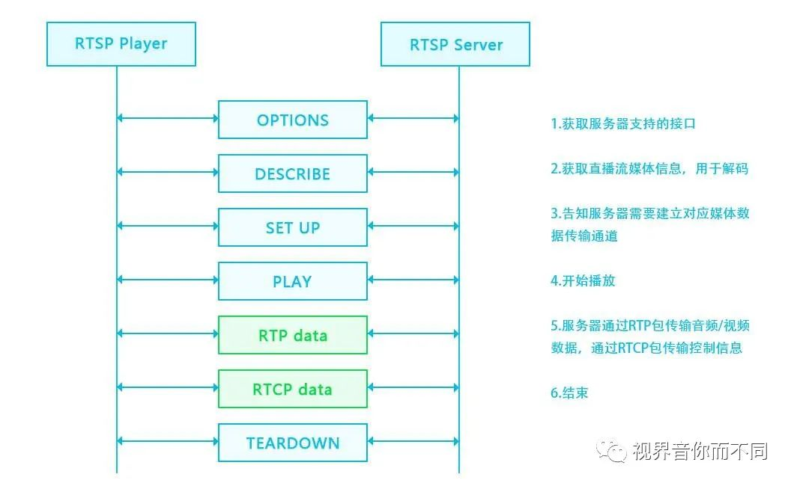

# rtsp_by_hand
手撕rtsp协议

哈喽，久违的小伙伴们！之前开了一个专辑手撕了rtmp协议！对于流媒体协议，rtsp协议也是很常见的，接下来我们继续手撕，手撕rtsp协议！本篇我们首先来简单了解一下rtsp协议并对其连接过程做一个概览！

1
rtsp协议简介

rtsp，英文全称 Real Time Streaming Protocol，RFC2326，实时流传输协议，是TCP/IP协议体系中的一个应用层协议！协议主要规定定了一对多应用程序如何有效地通过IP网络传送多媒体数据。RTSP体系结位于RTP和RTCP之上（RTCP用于控制传输，RTP用于数据传输），使用TCP或UDP完成数据传输！

2
rtsp基本交互过程

假设我们现在要向一个RTSP的sever发送请求获取数据，基本流程如下：

OPTIONS

C--->S

客户端向服务器端发现OPTIONS，请求可用的方法。

S--->C

服务器端回复客户端，消息中包含当前可用的方法。

DESCRIBE

C--->S

客户端向服务器请求媒体描述文件，一般通过rtsp开头的url来发起请求，格式为sdp。

S--->C

服务器回复客户端sdp文件，该文件告诉客户端服务器有哪些音视频流，有什么属性，如编解码器信息，帧率等。

SETUP

C--->S

客户端向服务器端发起建立连接请求，请求建立会话连接，准备开始接收音视频数据，请求信息描述了期望音视频数据包基于UDP还是TCP传输，指定了RTP，RTCP端口，以及是单播还是组播等信息！

S--->C

服务器端收到客户端请求后，根据客户端请求的端口号确定发送控制数据的端口以及音视频数据的端口!

图片
PLAY

图片
C--->S

客户端向服务端请求播放媒体。

S--->C

服务器回复客户端200 OK! 之后开始通过SETUP中指定的端口开始发送数据！

TEARDOWN

C---->S

结束播放的时候，客户端向服务器端发起结束请求

S--->C

服务端收到消息后，向客户端发送200 OK，之后断开连接

上述的流程基本涵盖了RTSP的流程，当然，RTSP除此之外，还有PAUSE，SCALE，GET_PARAMETER，SET_PARAMETER等参数。

3
Rtsp抓包示例

最后，老规矩，协议的分析和学习少不了抓包，抓包少不了Wireshark！贴一张RTSP抓包的图，来个直观的感受！

